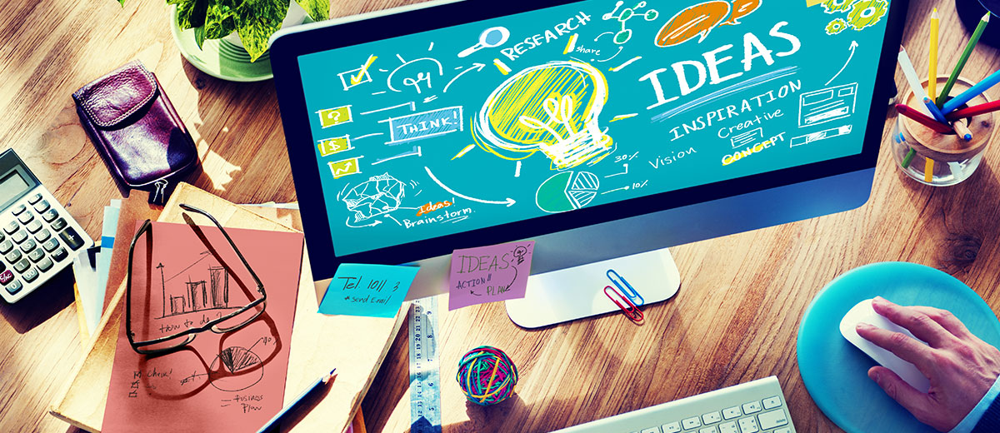

La animación y la graficación se han hecho más atractivas, dinámicas, y estéticas. La tecnología las ha llevado a nuevos estándares de calidad y eficiencia, propiciando también acceso masivo y el abaratamiento de softwares para el logro de resultados rápidos y económicos, y aunque la técnica a avanzado enormemente en las últimas décadas los principios de animación son los mismos en cualquier soporte, ya sea papel dibujado, plastilina o un personaje 3D; desde sus inicios la animación se ha servido de los mismos trucos para simular el movimiento.