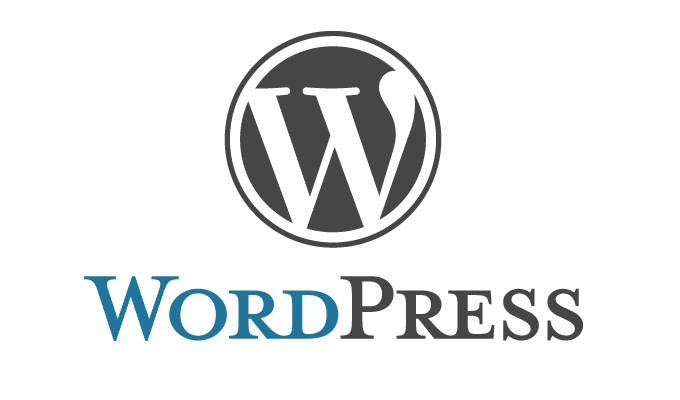

Es un cms que permite gestionar el contenido de páginas web y blogs donde almacena sus archivos en una base de datos, se le pueden añadir plugins, plantillas o temas y frameworks.
* Las plantillas o temas, aportan diseño a la web.
* Los plugins aportan funcionalidades extras. 

Mas informacion aqui : https://galamarketingonline.es/por-que-elegir-wordpress/                          

Mi pagina Oficial en Wordpress : https://157.230.176.97/
